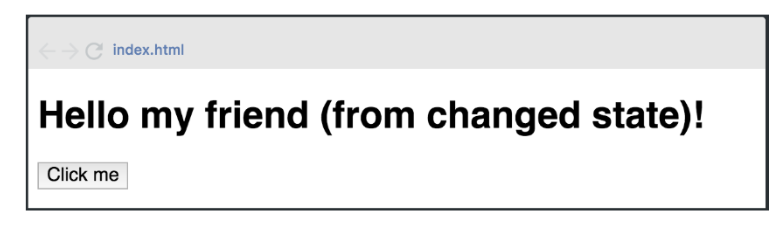

# Ejercicio 3 React

Modificar el programa anterior agregando al componente un state con la clave msj: “(from changed state)”, además agregar un botón al presionar este botón (onClick), el state de la clave msj se debe mostrar por pantalla de la siguiente manera:

Alumno: Navarro Bovi José